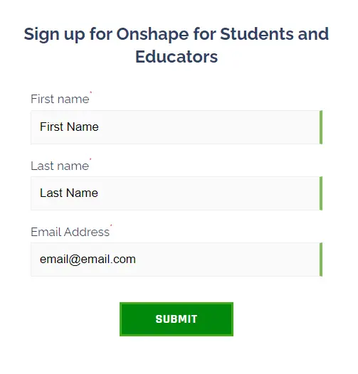
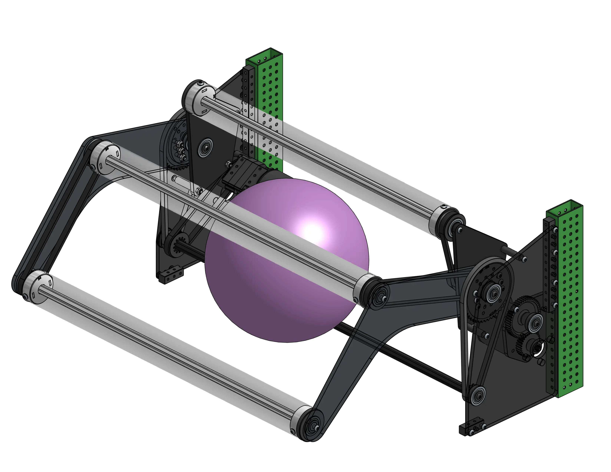
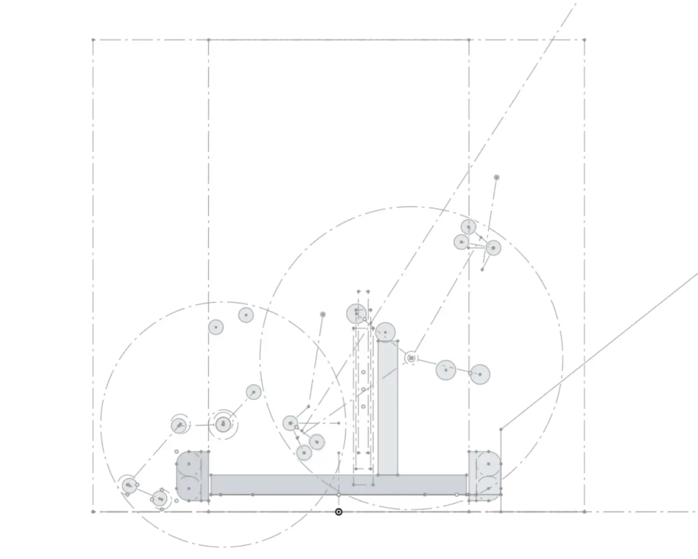

# FRC Design Learning Course

``` python
print("Hello, world!")
```

Welcome to the design learning course, the main purpose and content of the website! Keep in mind that it's always a work in progress, so if you find any issues or have difficulty understanding something, please reach out to a member!

The purpose of the course is to take you from zero to being able to model a full robot. The content focuses on FRC-relevant features and tools, using engaging projects that not only introduce new CAD skills and practice old ones but also introduce engineering concepts. These projects gradually get less guided as you progress.

!!! tip
    Despite how it looks, Onshape is quite different in its fundamentals from other CAD software. Start at [Stage 0A](stage0/0A/what-and-why-CAD.md) if you're switching from another CAD software or new to CAD, and [Stage 1A](stage1/1A/introduction.md) if you already have some experience using Onshape.  
    **You will struggle with later stages** if you don't have a solid grasp on the fundamentals of Onshape.

!!! warning
    If you choose to skip to Stage 0, make sure to add [MKCAD](stage0/0B/MKCad.md) and the [required featurescripts](stage0/0B/featurescripts.md) for the learning course.

!!! warning
    Before starting, remember to take a look at the [website feature guide](../website-feature-guide.md) to gain an understanding of the different features used throughout the learning course!

---
<div class="zoomable-container">
  
</div>

### [Stage 0](stage0/0A/what-and-why-CAD.md)

- For people that haven't used CAD or Onshape before  
- Introduction to CAD to read or skim  
- Walkthrough to set up Onshape account and add necessary tools  
- Guide on navigating Onshape  
- Basic theory that helps develop a good mindset

<div style="clear: both;"></div>

---



<div class="zoomable-container">
  
</div>

### [Stage 1](stage1/1A/introduction.md)

- Learn the fundamentals of sketching, part design, multi-part modeling, and assemblies through Onshape Learning Courses and FRC-relevant exercises  
- Learn about power transmission and modeling gearboxes  
- Model a swerve drivebase  
- Start learning top-down design workflow for FRC

<div style="clear: both;"></div>

---

<div class="zoomable-container">
  
</div>

### [Stage 2](stage2/2A/introduction.md)

- Learn about common mechanisms in FRC and model them  
- Practice CAD skills until you're significantly more comfortable with Onshape  
- Learn engineering concepts and mechanism design  
- Learn layout sketches for different mechanisms

<div style="clear: both;"></div>

---

<div class="zoomable-container">
  
</div>

### [Stage 3](stage3/3A/introduction.md) **(Under Construction)**

- Practice full robot main layout sketches  
- Replicate simple robots  
- Practice top-down workflow and integration

<div style="clear: both;"></div>

---

### [Stage 4](stage4.md) **(Under Construction)**

- Master mechanism design  
- Practice integration and workflow  
- Master practices that optimize load time and make collaboration easier  
- Study game history  
- Learn strategic design  
- Make more robots and mechanisms and get review and feedback
