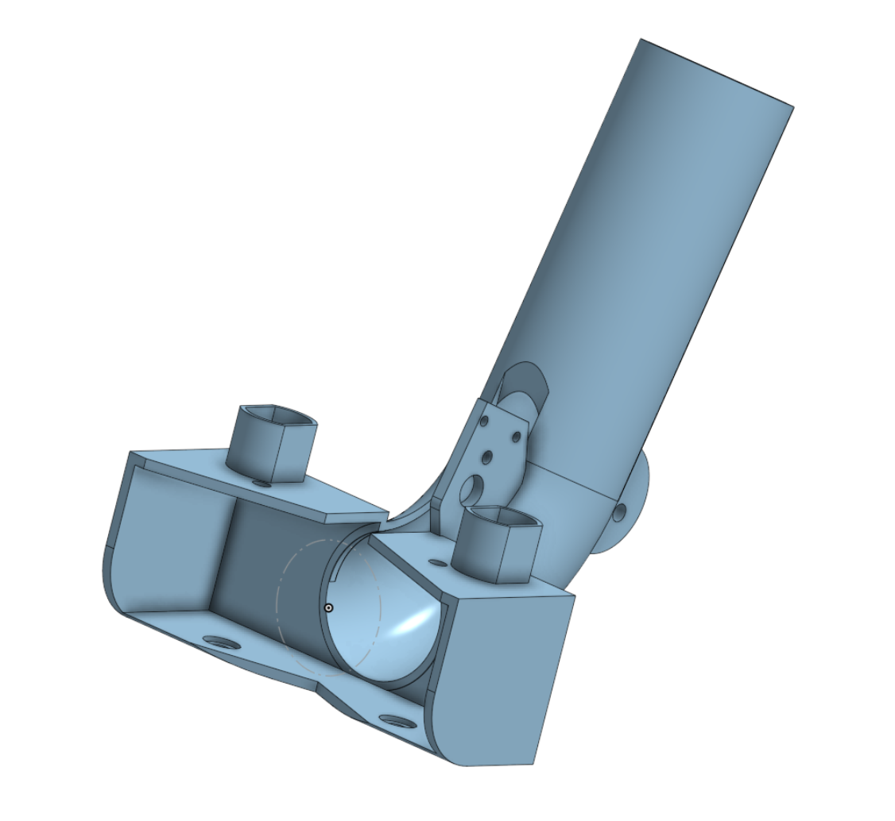
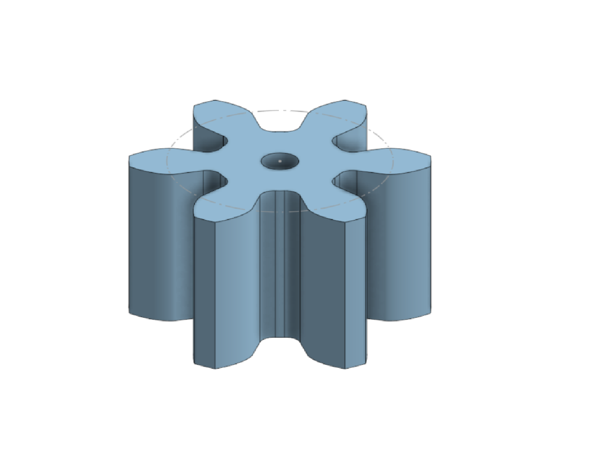
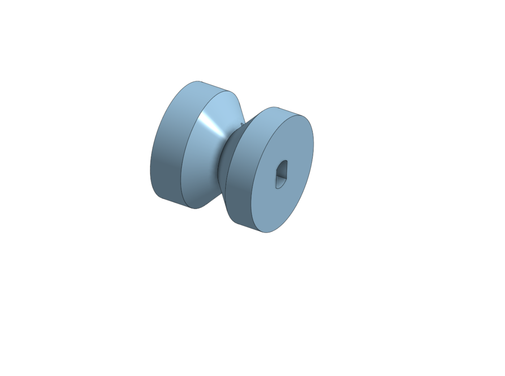
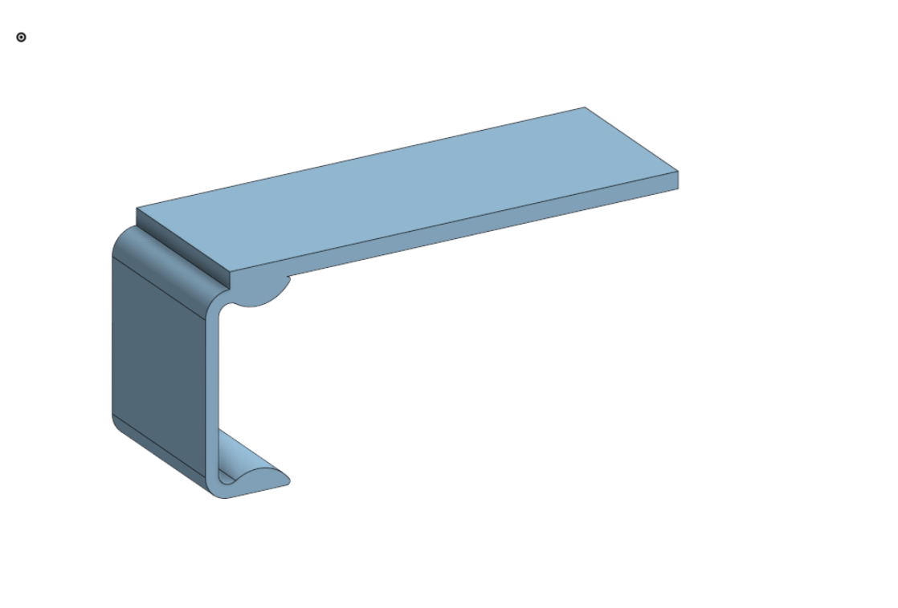
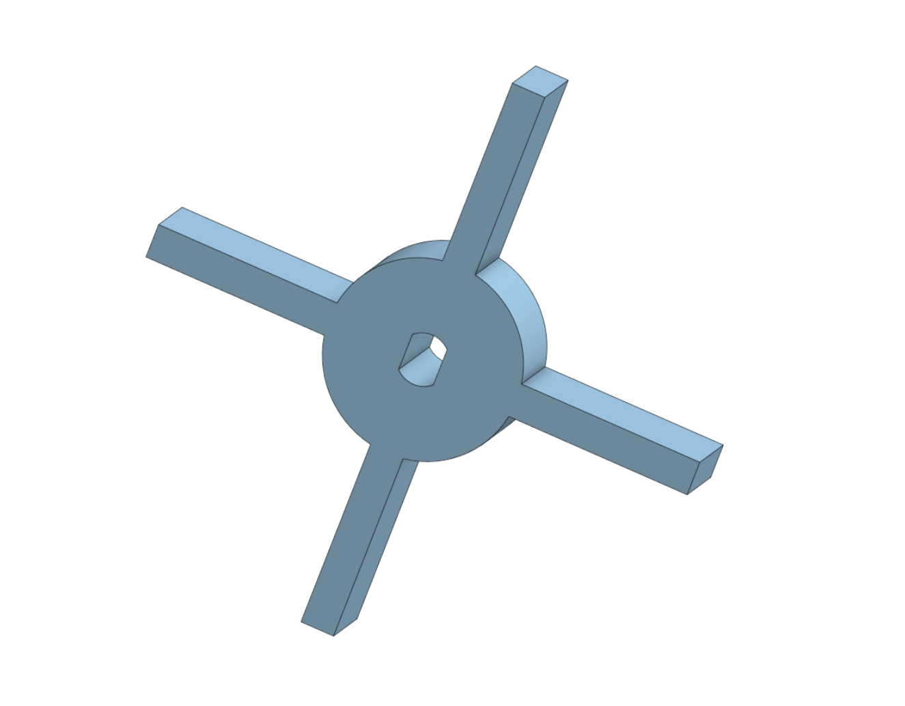
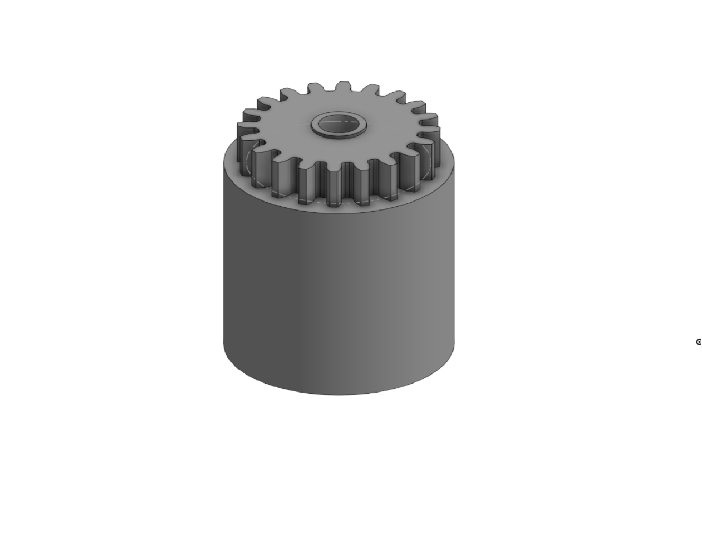
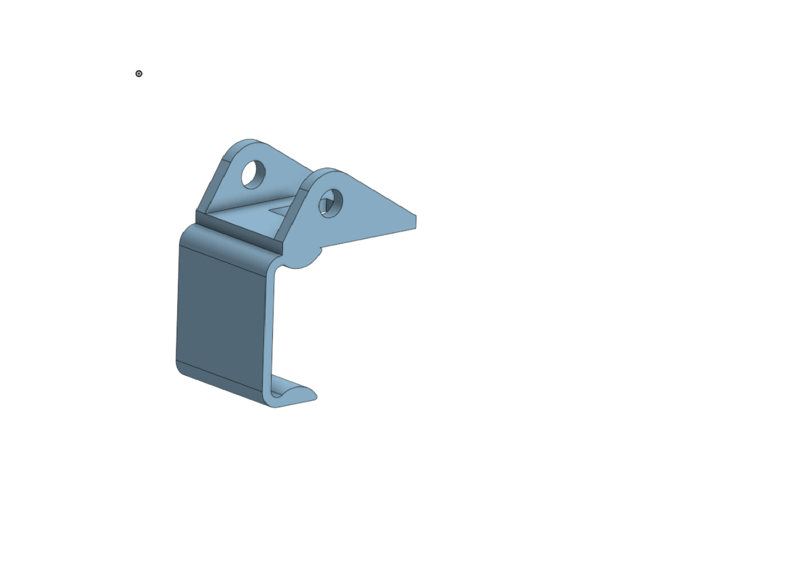
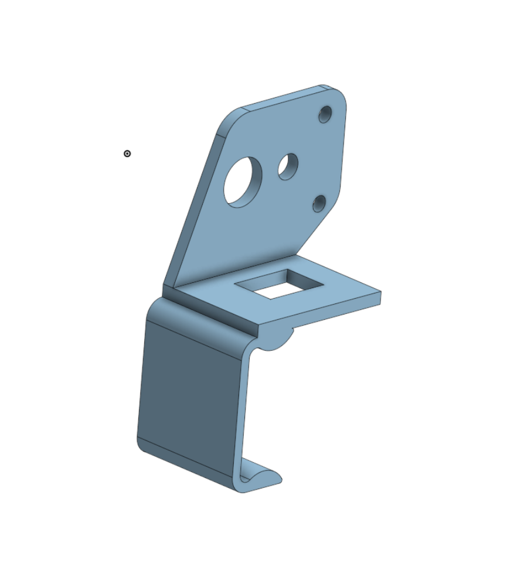

!!! note
    We will put images/video here for assembly of this robot. It is not too bad but does require custom wiring that goes beyond the scope of the base XRP instructions and will require an Arduino to run a sketch to interpret the code's ability to run the 6V shooter motors running the flywheels.

---

## Ping Pong Launcher Main Part
{: style="max-width:400px; display:block; margin: 20px auto; border: 2px solid #333; border-radius: 12px; box-shadow: 0 4px 10px rgba(0,0,0,0.3);" }

The Main Assembly Part to attach the Shooter Flywheels and Motor to. 6v motors have a friction fit, and the red motor uses zipties to attach to the frame.

---

## Motor Driving Pinion
{: style="max-width:400px; display:block; margin: 20px auto; border: 2px solid #333; border-radius: 12px; box-shadow: 0 4px 10px rgba(0,0,0,0.3);" }

Attaches to the small 6v motor shaft to allow for driving the flywheel.

Requires the Gear Generator Featurescript - [Access Gear Generator Onshape Featurescript](https://cad.onshape.com/documents/72d1bb826437a60af1fdd59c/w/2f2531a9f27d31cb4ee169d4/e/8f3bf9d133ff3fe42be9ab1e)

    

        <iframe 
            src="https://youtu.be/2q2hagoLq2M?si=sXpuPIWkwsDyIVGu" 
            width="1280" 
            height="720" 
            frameborder="0" 
            scrolling="no" 
            allowfullscreen 
            title="Onshape FeatureScript Demo" 
            style="border:none; position: absolute; top: 0; left: 0; width: 100%; height: 100%;">
        </iframe>
    

---

    

        <iframe 
            src="https://region15-my.sharepoint.com/personal/bmarganski_region15_org/_layouts/15/embed.aspx?UniqueId=5057a62b-b379-467a-9144-e96acc22630b&embed=%7B%22af%22%3Atrue%2C%22ust%22%3Atrue%7D&referrer=StreamWebApp&referrerScenario=EmbedDialog.Create&autoplay=true&loop=true" 
            width="1280" 
            height="720" 
            frameborder="0" 
            scrolling="no" 
            allowfullscreen 
            title="Onshape FeatureScript Demo" 
            style="border:none; position: absolute; top: 0; left: 0; width: 100%; height: 100%;">
        </iframe>
    

---

## Winch Roller
{: style="max-width:400px; display:block; margin: 20px auto; border: 2px solid #333; border-radius: 12px; box-shadow: 0 4px 10px rgba(0,0,0,0.3);" }

Winch Roller to pull/release a string for shooter angle control.

---

## Electronics Board
{: style="max-width:400px; display:block; margin: 20px auto; border: 2px solid #333; border-radius: 12px; box-shadow: 0 4px 10px rgba(0,0,0,0.3);" }

A board to hot glue the electronics required to get the shooter wheels spinning through code.

---

## Feeder
{: style="max-width:400px; display:block; margin: 20px auto; border: 2px solid #333; border-radius: 12px; box-shadow: 0 4px 10px rgba(0,0,0,0.3);" }

Feed balls in/up intake and roll balls out to be sent through flywheel at a set rate of speed.

---

## Flywheel
{: style="max-width:400px; display:block; margin: 20px auto; border: 2px solid #333; border-radius: 12px; box-shadow: 0 4px 10px rgba(0,0,0,0.3);" }

Main Shooting wheel, wrapped in rubber bands for friction; has gear mesh attached for 4:1 ratio to shoot balls.

---

## Main Assembly Mount
{: style="max-width:400px; display:block; margin: 20px auto; border: 2px solid #333; border-radius: 12px; box-shadow: 0 4px 10px rgba(0,0,0,0.3);" }

Mount to XRP to attach the main structure and pivot. A 10-32 bolt is used as the axle.

---

## Winch Motor Mount
{: style="max-width:400px; display:block; margin: 20px auto; border: 2px solid #333; border-radius: 12px; box-shadow: 0 4px 10px rgba(0,0,0,0.3);" }

Mount to XRP for the winch motor; use zipties to attach the motor.

