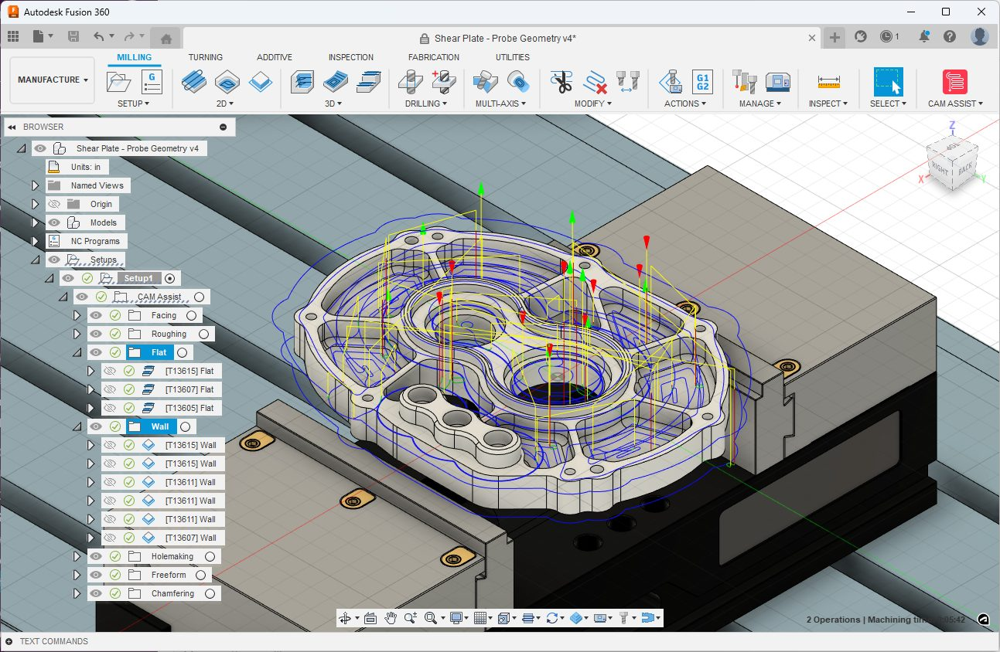

# {{ m2_2_8 }}

Autodesk Fusion
CAM (Computer Aided Manufacturing)

Tooling Options
A list of commonly used tooling for CNC Router
End Mills
1/4" O-Flute
1/8" O-Flute
1/4" Ball End Mill

Chamfer Bit
1/4" Chamfer Bit - 90 degree

Drills
1/4" Drill - Rarely used but can fit in machine
3/16in Drill - For 10-32 Screw Clearance and 1/4-20 tap Drill size
5mm
4mm
3mm
2mm

Facing Mill

