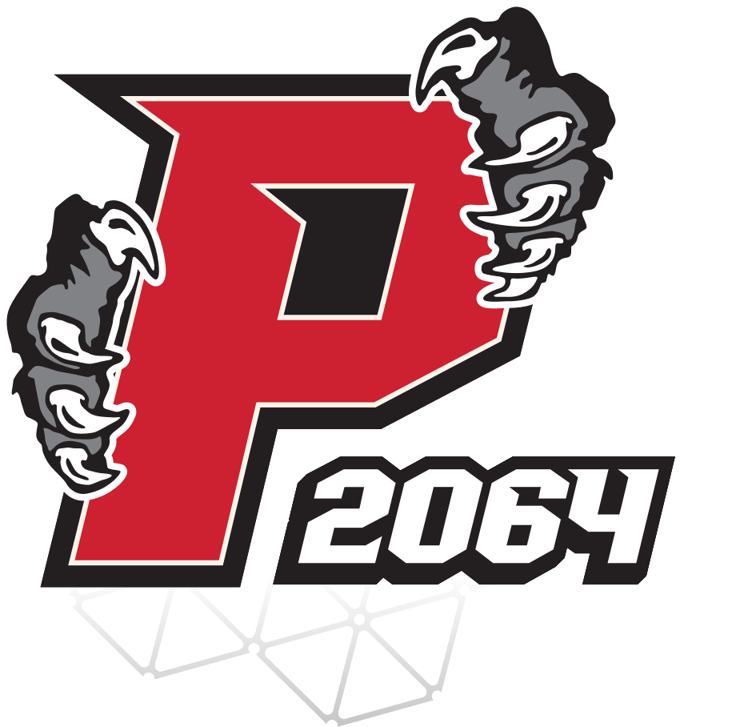

# 🐾 Welcome to The Panther Project
**FRC Team 2064**

{ align=left width="200" }

Welcome to the official documentation and training hub for Team 2064. Whether you are a rookie stepping into the shop for the very first time, or a veteran drive-team member looking up a CAD standard, everything you need to build great robots is right here.

!!! success "New Member? Start Here!"
    If you are new to the team, your journey begins with **Phase 1**. You must complete all sections of Module 1.3 (Safety) before you can touch any tools in the shop. 

!!! info "Flexible Learning"
    While working within a *PHASE* you may complete modules in any order that suits your schedule. However, **check the Prerequisites** at the top of each page to ensure you are eligible to complete the assignment.

!!! tip "📅 Stay on Schedule"
    Skill-training seminars for specific modules are scheduled throughout the season. Check the [Team Google Calendar](https://calendar.google.com/calendar/embed?src=c_a246400a88a21fe4e3b65cc96f43ae4020788d8410fe2a1c572ab632d872a20a%40group.calendar.google.com&ctz=America%2FNew_York) frequently—missing a seminar may delay your ability to complete a module! **Some Seminars require registration to attend, so be sure to sign up once you know what you need**

---

## 🏁 Phase 1: Rookie Foundations
Welcome to The Panther Project! Before you can build a 125-pound competition robot, you need to master the basics. Phase 1 is mandatory for all new members, regardless of prior experience. You will learn how to safely navigate the shop, use core hand tools, and build a miniature XRP Starter Bot to prove your baseline knowledge. Once you pass Phase 1, you unlock the rest of the shop!

**[Start Here: Welcome to Team 2064!](frc/rookielanding.md){ .md-button }**

??? info "Click to view Phase 1 Modules & Skills"

    ??? abstract "🤖 Module 1.1: FRC Basics" 
        *Learn basic tasks required for FRC involvement and understanding.*

        * **[1.1.1 - Intro to FIRST](frc/FIRST.md):** Overview of FRC, its place in FIRST, and how competitions work.
        * **[1.1.2 - Bot Basics](frc/botbasics.md):** Common parts of an FRC robot.
        * **[1.1.3 - Game Analysis](frc/gameanalysis.md):** Analyze a past game and pass a quiz on the game content to show rule understanding.
        * **[1.1.4 - The Engineering Design Process](engineering/designprocess.md):** Brainstorming, prototyping, and documenting decisions.
        * **[1.1.5 - Build Season](frc/buildseason.md):** The FRC Build Season timeline and what to expect.
        * **[1.1.6 - Power On](frc/poweron.md):** Basic demonstration on how to power Team 2064's competition robot on and operate it.

    ??? abstract "📐 Module 1.2: Basic CAD"
        *Gain an understanding of the Onshape software for designing parts of a robot.*
        
        * **[CAD Overview](engineering/cad/CAD.md):** Welcome to mechanical design.
        * **[1.2.1 - Onshape Stage 0 (What is CAD)](engineering/cad/stage0.md):** General information on CAD and Onshape setup.
        * **[1.2.2 - Onshape Stage 1A (Fundamentals)](engineering/cad/stage1A.md):** Sketching, extruding, and multi-part studios.
        * **[1.2.3 - Onshape Stage 1B (Power Transmissions)](engineering/cad/stage1B.md):** Fundamentals of power transmissions in CAD.
        * **[1.2.4 - Onshape Stage 1C (Practice Mechanisms)](engineering/cad/stage1C.md):** Model different mechanisms to practice execution.

    ??? abstract "🛡️ Module 1.3: Safety Certification"
        *Learn our core shop rules, PPE requirements, and pass the mandatory safety assessment.*
        
        * **[Safety Introduction](safety/safetylanding.md):** Welcome to the shop.
        * **[1.3.1 - General Safety Guidelines](safety/Safety.md):** Core shop rules, PPE, and emergency procedures.
        * **[1.3.2 - Machine Safety Guidelines](safety/machinesafety.md):** Specific safety rules for general machines.
        * **[1.3.3 - Certification Quiz](safety/Safetyquiz.md):** The mandatory assessment required to work in the shop.
        * **[1.3.4 - Safety Practical](safety/safetypractical.md):** Physical demonstration of appropriate safety usage.
    
    ??? abstract "🔨 Module 1.4: Basic Fabrication (Levels 1 & 2)" 
        *Master the fundamentals of hand tools, power tools, and shop organization.*

        * **Level 1: General Shop (Unpowered)**
            * **[1.4.1 - Workspace Organization](fabrication/level1/Closet.md):** Closet management and battery care.
            * **[1.4.2 - Fasteners](fabrication/level1/fasteners.md):** Learn about the hardware used on the robot. 
            * **[1.4.3 - Measuring Devices](fabrication/level1/measuring/measuringtools.md):** Calipers and tape measures.
            * **[1.4.4 - Hand Tools: Wrenches](fabrication/level1/handtools/Handtools.md):** Wrenches and allen wrenches
            * **[1.4.5 - Pliers](fabrication/level1/handtools/pliers.md):** Pliers and other tools
            * **[1.4.6 - Wiring & Crimping](fabrication/level1/handtools/crimping.md):** Secure electrical connections.
            * **[1.4.7 - 3D Printer Fundamentals](fabrication/level1/3dprinter.md):** Learn to export STEP files and prepare for 3D Printing basic models.
            * **[1.4.8 - Skill Check - Level 1](fabrication/level1/handtoolsquiz.md):** Show your understanding of Level 1 skills. 
        * **Level 2: Power Tools**
            * **[1.4.9 - Cordless Drill](fabrication/level2/poweredhandtools/poweredtools.md):** Cordless drill explanation
            * **[1.4.10 - Cordless Saw](fabrication/level2/poweredhandtools/cordlesssaw.md):** Overview of the cordless bandsaw
            * **[1.4.11 - Soldering Iron](fabrication/level2/powertools/soldering.md):** Permanent FRC electrical connections.
            * **[1.4.12 - Horizontal Bandsaw](fabrication/level2/stationary/horizontalsaw.md):** Basic stationary cutting.
            * **[1.4.13 - Skill Check - Level 2](fabrication/level2/powertoolsquiz.md):** Finish your level 2 Rookie fabrication pathway with this skill practical.
    
    ??? abstract "🤖 Module 1.5: XRP Starter Bot"
        *Assemble, wire, and program a functional mini-robot to prove your baseline engineering skills.*
        
        * **XRP Start (The Basics):**
            * **[1.5.1 - Build Guide](xrprobotics/module1/Build.md):** Chassis assembly.
            * **[1.5.2 - Firmware Installation](xrprobotics/module1/gettingtoknow.md)** Make your robot connect to VScode wirelessly for deploying JAVA.
            * **[1.5.3 - VSCode and WPILib](xrprobotics/module1/xrpwpilib.md):** Setting up the FRC programming environment.
            * **[1.5.4 - Command-Based Code](xrprobotics/module1/basicdriveXRP.md):** Writing Java to drive the XRP.
            * **[1.5.5 - Drive Challenge Skill Check](xrprobotics/module1/XRPdrivechallenge.md)** Demo your XRP can drive with and perform a simple auto you created!
        * **XRP Advanced (Ping Pong Launcher):**
            * **[1.5.6 - Launcher Game Concepts](xrprobotics/module2/Ping-Pong-Launcher-Challenge.md)** Advanced ping pong challenge, simulating REBUILT season game small scale!
            * **[1.5.7 - Ping Pong Assembly](xrprobotics/module2/PingPongAssemble.md)** Steps to create ping pong bot.
            * **[1.5.8 - Launcher Wiring](xrprobotics/module2/wiringpingpongxrp.md)** Wiring Ping Pong Bot
            * **[1.5.9 - Launcher Code](xrprobotics/module2/pingpongcode.md)** Ping Pong robot code with Arduino
            * **[1.5.10 - Launcher Competition](xrprobotics/module2/PingPongCompetition.md)** Game rules and game manual.

---

## 🚀 Phase 2: Specialization Pathways
An FRC team is built like a small engineering firm—it is simply too massive for one person to do everything. Phase 2 is where you choose your specialty and master it. Whether you want to design mechanisms in CAD, operate heavy precision machinery, write autonomous code, or manage the team's brand and media, this phase gives you the deep, focused training you need.

**[Choose Your Specialty](engineering/engineeringlanding.md){ .md-button }**

??? info "Click to view Phase 2 Pathways & Skills"

    ??? abstract "📐 Pathway 2.1: Advanced Mechanical & CAD"
        *Design the machine. Master Onshape, mechanisms, and the Engineering Design Process.*
        
        * **[2.1.1 - Stage 1D (Design Methodology)](engineering/cad/stage1D.md):** Top-down design and advanced assemblies.
        * **[2.1.2 - Stage 1E (Subsystem Workflow)](engineering/cad/stage1E.md):** Typical workflow when modeling a subsystem.
        * **[2.1.3 - CAD Course Skill Check](engineering/cad/cadonshapecourse.md):** Your final CAD assessment.
        
    ??? abstract "🏭 Pathway 2.2: Advanced Fabrication (Levels 3 & 4)"
        *Build the machine. Safely operate heavy precision machinery and digital fabrication tools.*
        
        * **Level 3: Stationary Equipment:**
            * **[2.2.1 - 3D Printing Workflow](fabrication/level3/3dprinting2.md):** Slicing, filaments, and SLA.
            * **[2.2.2 - Bandsaw Operations](fabrication/level3/bandsaw.md)** Cut contours out of raw material and learn what to do and what not to do with this tool.
            * **[2.2.3 - Lathe Operations](fabrication/level3/lathe.md):** Turning shafts and cutting grooves.
            * **[2.2.4 - Milling Machine Basics](fabrication/level3/millingmachine.md):** Squaring stock and edge finding.
            * **[2.2.5 - Skill Check - Level 3](fabrication/level3/machinelessons.md)**
        * **Level 4: Digital Fabrication:**
            * **[2.2.6 - Laser Engraver Workflow](fabrication/level4/laserengraver.md):** Vector cutting and etching.
            * **[2.2.7 - CNC Router Operations](fabrication/level4/cncrouter.md):** CAM setups, feeds, and speeds.
            * **[2.2.8 - Skill Check - Level 4](fabrication/level4/machinelessonsadvanced.md)**

    ??? abstract "💻 Pathway 2.3: Software & Controls"
        *Bring the robot to life. Master Java, autonomous routines, and advanced sensor integration.*
        
        * **[2.3.1 - Java & WPILib Basics](engineering/programming/WPIlib.md):** Subsystems, commands, and motor controller APIs.
        * **[2.3.2 - Sensor Integration](engineering/programming/sensors.md):** Reading encoders, gyros, and limit switches.
        * **[2.3.3 - Autonomous Routines](engineering/programming/autonomous.md):** Path planning and trajectory following.
        * **[2.3.4 - Vision Processing](engineering/programming/vision.md):** Tuning pipelines using PhotonVision or Limelight.
        * **[2.3.5 - PID Control & Tuning](engineering/programming/advancedjava.md):** Making mechanisms move quickly and stop accurately.

    ??? abstract "📸 Pathway 2.4: NEMO & Media"
        *Non-Engineering Member Opportunities (NEMO). Create media, manage PR, and build the brand.*
        
        * **[NEMO Overview](media/medialanding.md):** Welcome to the media and business team.
        * **[2.4.1 - Branding Guidelines](media/branding.md):** Official fonts, hex codes, and uniform guidelines.
        * **[2.4.2 - Adobe Photoshop](media/photoshop.md):** Photo editing and social media asset creation.
        * **[2.4.3 - Adobe Illustrator](media/illustrator.md):** Vector design for banners and apparel.
        * **[2.4.4 - Cricut Vinyl Cutter](media/cricut.md):** Cutting decals and applying transfer tape.
        * **[2.4.5 - Button Maker Operations](media/buttonmaker.md):** Designing and pressing team buttons.
        * **[2.4.6 - Public Speaking](media/publicspeaking.md):** Presentation prep and pit speaking for the Impact Award.

---

## 🏆 Phase 3: Advanced Competition & Leadership Mastery
Building the robot is only half the battle. Phase 3 is reserved for veteran members, subteam leads, and the drive team. These modules zoom out from individual part creation to macro-level team operations and event execution. This is where you learn to manage projects, lead peers, and ultimately win events.

**[Explore Leadership Pathways](leadership/leadershiplanding.md){ .md-button }**

??? info "Click to view Phase 3 Modules & Skills"

    ??? abstract "📊 Pathway 3.1: Strategy & Data Analytics"
        *Taking the game from the shop to the field. Master the data required to win events.*
        
        * **[3.1.1 - Game Manual Deep Dive](strategy/game-manual.md):** How to read, interpret, and exploit the rules.
        * **[3.1.2 - Scouting Architecture](strategy/scouting.md):** Designing digital scouting apps to collect data.
        * **[3.1.3 - Data Visualization](strategy/data-viz.md):** Creating pit dashboards for the Drive Team.
        * **[3.1.4 - Alliance Selection Theory](strategy/alliance-selection.md):** Calculating EPA, OPR, and building pick-lists.

    ??? abstract "🏎️ Pathway 3.2: Pit Crew & Event Operations"
        *Executing under pressure. These classes train the elite members who keep the robot alive.*
        
        * **[3.2.1 - Packing Manifest](competition/packing.md):** Managing battery carts and pit checklists.
        * **[3.2.2 - Triage & Troubleshooting](competition/triage.md):** The 8-minute turnaround between matches.
        * **[3.2.3 - Inspection Process](competition/inspection.md):** Navigating sizing, weight, and hardware checks.
        * **[3.2.4 - Field Connectivity](competition/field-checks.md):** Verifying the driver station and staging protocols.
        * **[3.2.5 - Bumper Construction](engineering/bumpers.md):** Rules, wood cutting, fabric wrapping, and mounting.

    ??? abstract "📋 Pathway 3.3: Project Management & Leadership"
        *Running the team like an engineering firm. Required for all Captains and Subteam Leads.*
        
        * **[3.3.1 - FRC Timeline](leadership/timeline.md):** Managing the 6-week build season milestones.
        * **[3.3.2 - Awards](leadership/awards.md):** FRC awards and how to align towards them in a season. 
        * **[3.3.3 - Design Review](leadership/design-review.md):** Leading meetings and locking in dimensions.
        * **[3.3.4 - Budgeting & POs](leadership/budget.md):** Researching COTS parts and requesting quotes.
        * **[3.3.5 - The Art of Mentorship](leadership/mentorship.md):** How to teach Rookies without "doing the work for them."

---

## 📚 Team Library & Links
Access the FRC glossary, Core Values, and general reference materials anytime.

* **Team Resources:** [View Core Values & Glossary](resources/resourceslanding.md)
* **Current Season:** [REBUILT (2026)](https://www.firstinspires.org/programs/frc/game-and-season)
* **Team Repository:** [GitHub - The Panther Project](https://github.com/FRC-2064)
* **Social Media:** [Instagram @frc2064](https://www.instagram.com/frc2064/)
* **Discord:** [2064 Member Discord Channel](https://discord.com/invite/svfrdGXrEe)

!!! quote "Core Value Check"
    *"We don't just build robots; we build the students who build the robots."*
