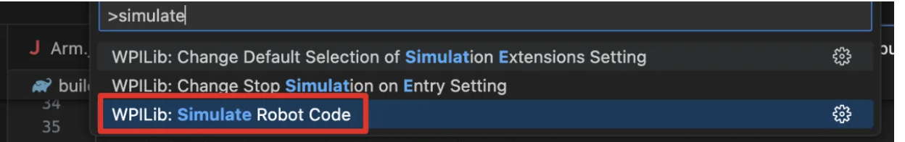
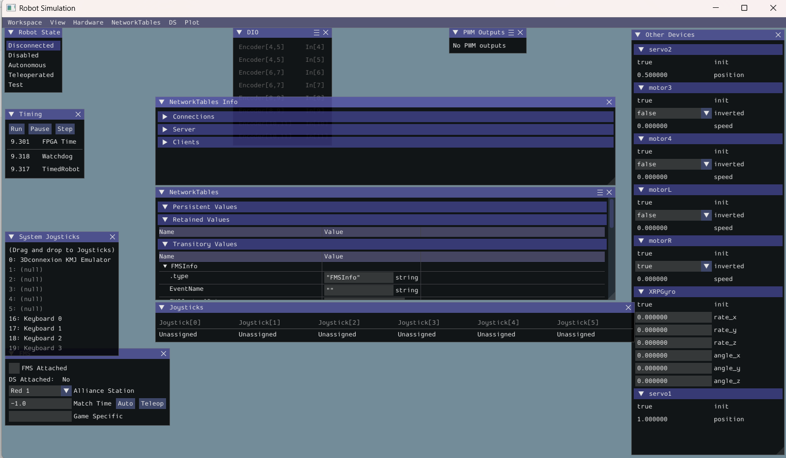

# 🚗 XRP Basic Driving (Command-Based)
> **Objective:** Download, build, and deploy a basic Command-Based template to drive the XRP robot using a PS4 controller.

[View Source Code on GitHub :material-github:](https://github.com/FRC-2064/XRP-Cammand-Based-Introduction){ .md-button }

!!! note "Curriculum To-Do"
    We still need to create a comprehensive 0-to-XRP guide that builds from a blank template. This will eventually lead into more complex FRC methodologies, including PID tuning and State Machine discussions.

---

## 🛑 Prerequisites
Before downloading the code, ensure your environment is set up:

* **WPILib VSCode:** You must have the official FRC WPILib version of VSCode installed. Do not proceed until this step is complete.
* **PS4 Controller:** Connect a PS4 controller to your computer via Bluetooth so you can drive wirelessly. 
    * *Note: The current code relies on the PS4's Triangle/Square/Circle/Cross layout. If you use a different controller (like Xbox), you will need to rewrite the controller bindings in the code.*

---

## 🚀 Step-by-Step Deployment

### Step 1: Download and Prepare the Code
1. Download the repository as a ZIP file from the link above and unpack the folder.
2. Open the unpacked folder using **VSCode**.
3. **Stay connected to your normal Wi-Fi.** VSCode must download necessary WPILib dependencies from the internet the first time you open the project.

### Step 2: Connect to the XRP
1. Turn on the XRP robot and wait for it to boot.
2. Switch your computer's Wi-Fi network from your home/school internet to the XRP's broadcasted signal.
3. **Password:** `xrp-wpilib`

### Step 3: Build and Simulate
To drive the XRP, we use the WPILib Simulation GUI, which acts as a virtual Driver Station.

1. Click the **WPI Logo** in the top right corner of VSCode (or press `Ctrl+Shift+P` / `Cmd+Shift+P`).
2. Type and select **"Simulate Robot Code"**.

!!! info "Be Patient!"
    It will take some time to compile the code the first time (1 to 3 minutes). As a rule of thumb: If it hasn't thrown a red error in the terminal, it is still compiling!

---

## 🎮 Step 4: Time to Drive

Once the simulation GUI loads, you are ready to connect your controller and enable the robot.

1. **Assign your Controller:** Look at the "System Joysticks" window. Drag and drop your connected PS4 controller into the **Joystick (0)** slot (unless you assigned a different port in your code).
2. **Enable the Robot:** Under the "Robot State" window, select **Teleoperated**. 

!!! danger "Watch the Edge!"
    As soon as you select Teleoperated, the robot is live! **Do not test this on a table**, or the XRP may drive off the edge and break. Place the robot on the floor before moving the joysticks.
