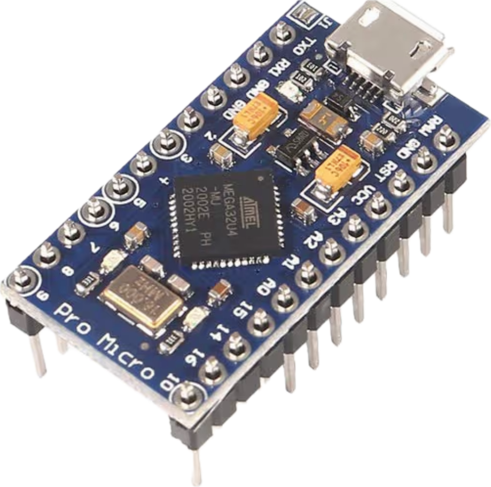

# ⚡ XRP High-RPM Motor Bridge
> **Custom Electronics:** This manifest defines the wiring for an **Arduino Pro Micro** acting as a sub-controller for the **XRP**.

!!! info "Prerequisites"
    This step assumes your base XRP is already built and wired. This is a custom add-on required to run the High-RPM motors for the ball launcher. It also provides expansion slots for additional add-ons in the future.

!!! warning "Stop!"
    Only continue with this wiring step if you have **completed the physical assembly** of the Ping Pong bot. If not, go back to the Assembly Guide now.

---

  

---

## 🧠 Method & Reasoning
The standard XRP motors are too slow for shooting a ping pong ball, and the XRP board doesn't have enough motor ports for our design. We solve this by adding custom electronics:

* **1. The "Smart Controller" (Arduino Pro Micro):** The Arduino takes the single command from WPILib (e.g., "Shoot at 80% speed"), does the math, and translates it into the specific dual-pin hardware signals needed by the motor driver.
* **2. The "Heavy Valve" (L9110S Motor Driver):** This chip acts as a heavy-duty electronic valve. It connects directly to the 6V battery to pull high current, and waits for a tiny, low-current signal from the Arduino to tell it how much power to let through. This keeps dangerous electrical current isolated from your delicate XRP brain.

!!! abstract "The FRC Big Picture: Why We Build This"
    By building this custom bridge, you are accidentally building an exact, miniature replica of how a 125-pound FRC competition robot handles its drivebase and shooters! 
    
    In a real FRC robot, the RoboRIO (your XRP) does not power the motors directly. It sends a low-voltage data signal to a Spark MAX or Talon FX (your Arduino + L9110S). That smart controller then pulls massive current straight from the Power Distribution Panel (your direct 6V battery wire) to spin a NEO or Kraken motor (your high-RPM 130 motors).

---

## 🔌 Master Wiring Table
*Follow this table precisely. Ensure your robot is powered OFF and the battery is unplugged before making these connections.*

| Connection Group | From (Component : Pin) | To (Component : Pin) | Logic/Voltage | Purpose |
| :--- | :--- | :--- | :--- | :--- |
| **Control Signal** | **XRP SERVO2:** Signal (IO17) | **Pro Micro:** Pin 2 | PWM | Signal from WPILib |
| **Common Ground** | **L9110S:** Ground (GND) | **XRP SERVO2:** Ground (GND) | 0V | Completes the circuit |
| **Arduino Power** | **XRP SERVO2:** Power (Center/Red) | **Pro Micro:** RAW | 5V | Powers the Arduino |
| **Motor A Drive** | **Pro Micro:** Pin 5 & 6 | **L9110S:** A-1A & A-1B | 5V Logic | Speed/Direction A |
| **Motor B Drive** | **Pro Micro:** Pin 9 & 10 | **L9110S:** B-1A & B-1B | 5V Logic | Speed/Direction B |
| **Motor Power** | **XRP Battery:** Red Wire | **L9110S:** VCC | 6V Battery | **High Current Supply** |
